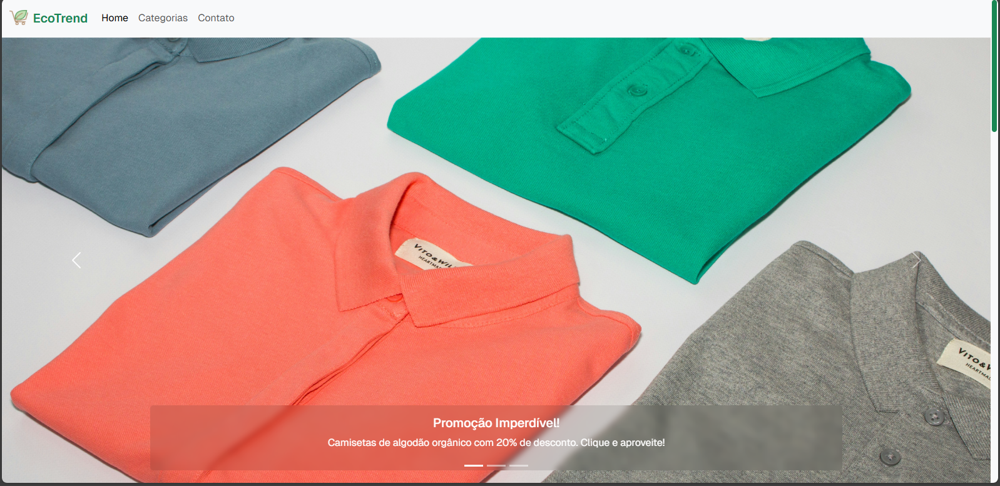
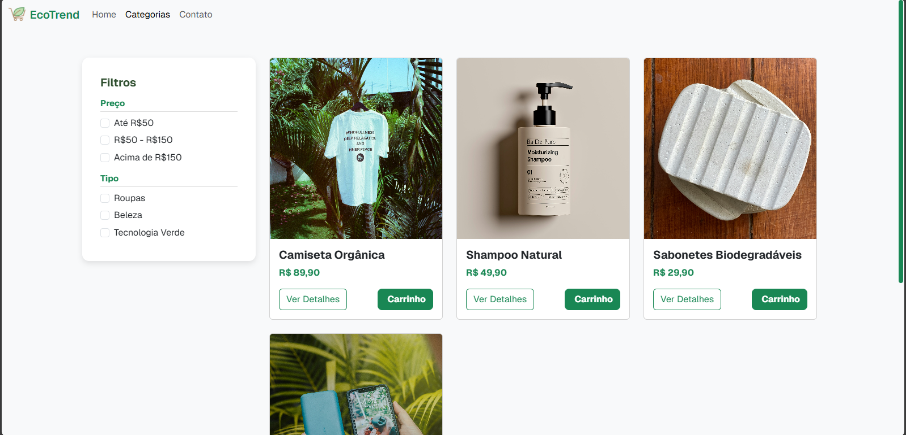
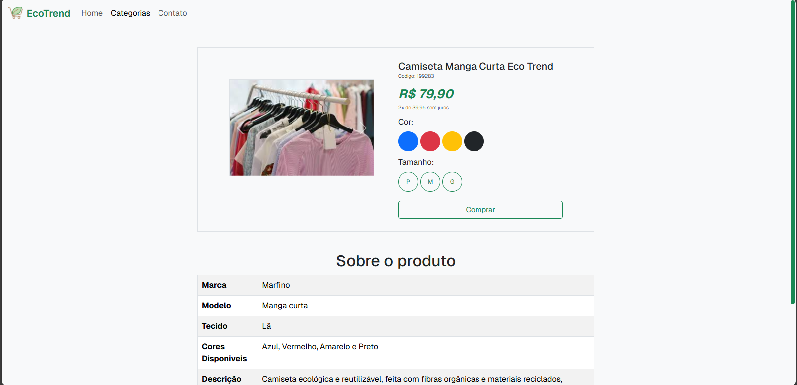
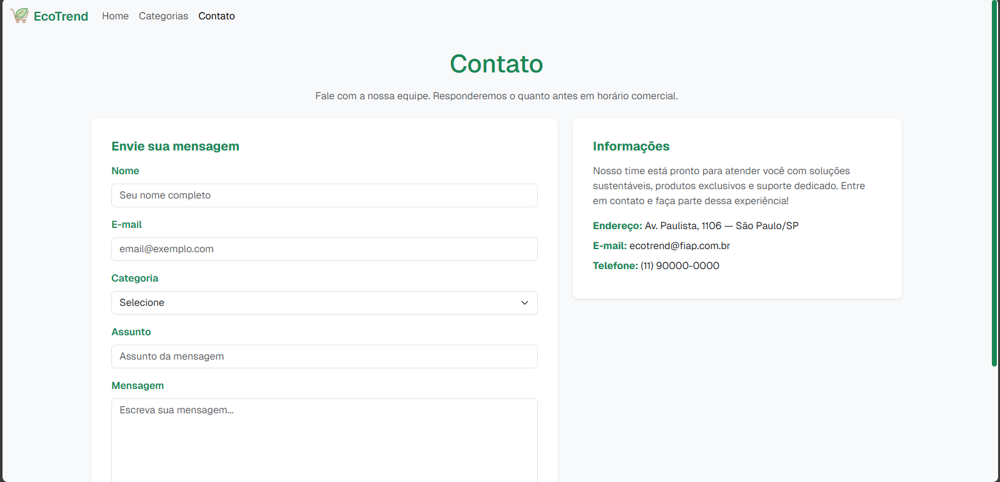

<h1 align=center>♻️Loja EcoTrend</h1>
<b><i>Um e-commerce especializado em produtos sustentáveis e ecológicos, focado em promover um estilo de vida mais consciente e sustentável</i></b>

## 🛒Produtos
- Roupas e acessórios sustentáveis;​
- Produtos de beleza e cuidados pessoais naturais;​
- Itens para casa sustentáveis;​
- Tecnologia verde.

## 🎯 Objetivo
Desenvolver uma interface responsiva de um e-commerce especializado em produtos sustentáveis, utilizando HTML, CSS, Grid Layout, e Bootstrap.​

## 📃Paginas Desenvolvidas
### Home

### Categorias

### Detalhes do Produto

### Contato

## 👀 Como acessar o Projeto
Para que o projeto seja acessado, use o link para o Github Pages(aqui) ou clone o repositorio.

## 🧰Tecnologias Utilizadas
- Linguagem de marcação: HTML5
- Linguagem de estilo: CSS3
- Framework: BootStrap v5.3(English version)
- IDE: Visual Studio Code
- Software de Versionamento: Git
- Repositório Remoto: GitHub
- Biblioteca de Fontes: Google Fonts
- Biblioteca de Icones: Fonts Awesome

## 🧑‍💻 Equipe
<table>
  <tr><th>Integrantes</th><th>Tarefas</th></tr>
    <tr>
    <td align = "center">
      
<a href = "https://github.com/dev-camila">Camila Martins</a>
<b>RM:561492</b>
    </td>
    <td>
      <ul>
        <li>Página de Contato</li>
      </ul>
    </td>
  </tr>
    <tr>
    <td align = "center">
      
<a href = "https://github.com/gabrielamara98">Gabriel Amara</a>
<b>RM:561403</b>
    </td>
    <td>
      <ul>
        <li>Gestão do README e repositório</li>
        <li>Página Detalhes do Produto</li>
      </ul>
    </td>
  </tr>
    <tr>
    <td align = "center">
      
<a href = "https://github.com/godooooy">Guilherme Godoy </a>
<b>RM:564417</b>
    </td>
    <td>
      <ul>
        <li>Página de Categorias</li>
      </ul>
    </td>
  </tr>
    <tr>
    <td align = "center">
      
<a href = "https://github.com/pedroviscz">Pedro Lucas Almeida</a>
<b>RM:566256</b>
    </td>
      <td>
      <ul>
        <li>Desenvolvimento de Header e Footer</li>
        <li>Página Home</li>
      </ul>
      </td>
</table>
